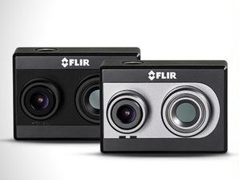
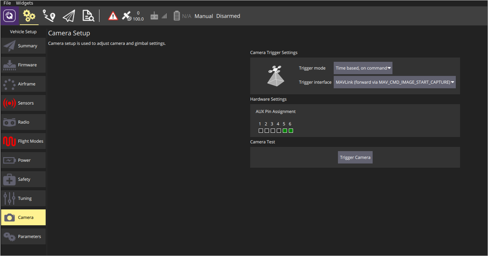
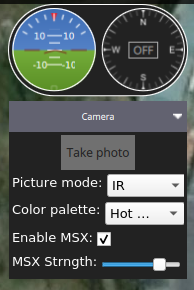
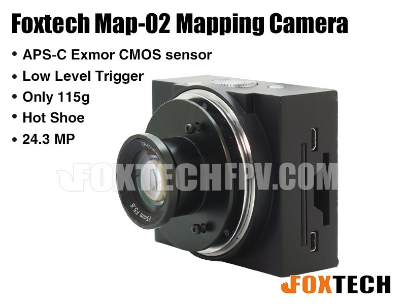
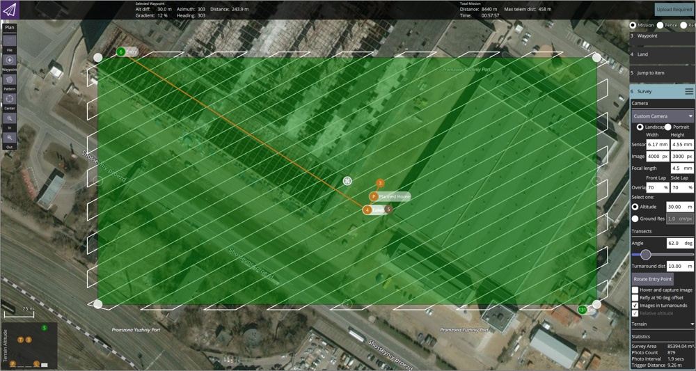
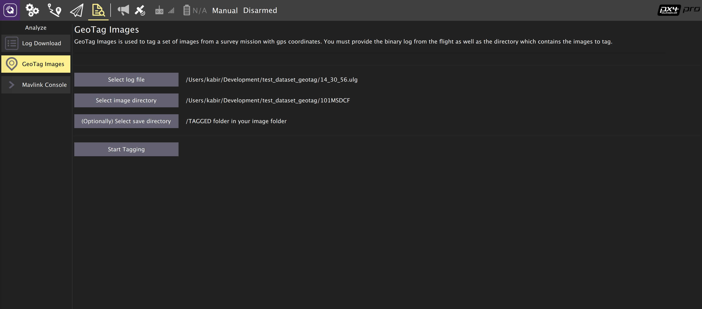

# Камеры

Подключение внешних камер и работа с ними.

## Flir Duo



Flir Duo представляет собой первое в мире компактное, легкое радиометрическое средство отображения инфракрасного и видимого спектра, разработанное для профессионального использования на частных беспилотных летательных аппаратах (дронах).

Камера имеет возможность общаться с БПЛА по протоколу MAVLink. С его помощью можно изменять настройки, посылать команды на съемку фото и видео, передавать данные о местоположении аппарата.

### Подключение

Для подключения камеры к полетному контроллеру Pixhawk необходимо воспользоваться штатным miniUSB-кабелем камеры. Соединяем выход PWM2 и PWM1 камеры с пинами RX и TX соответственно разъемов telem1 или telem2 контроллера.


Встроенного аккумулятора у камеры нет, необходимо запитать ее по usb.

### Настройка камеры

Для настройки камеры используется приложение [Flir UAS](https://play.google.com/store/apps/details?id=com.flir.vuepro&hl=ru) для мобильного телефона. Приложение взаимодействует с камерой по Bluetooth.

Для того, чтобы камера общалась с полетным контроллером по протоколу MAVLink необходимо:

- Включить bluetooth на камере (нажать на кнопку с соответствующим значком на камере - загорится синий светодиод).
- Включить приложение на телефоне, оно произведет поиск камеры.
- Подключиться к Flir Duo.
- На вкладке Controller выбрать MAVLink как протокол для общения по Serial.

### Настройка PX4

Для настройки полетного контроллера используйте приложение [QGroundControl](http://qgroundcontrol.com/).​

Подключитесь к дрону, перейдите на панель настроек, на ней выберите пункт "Camera" - откроется страница настроек камеры. В выпадающем списке "Trigger Interface" выберите "MAVLink" (TRIG_INTERFACE=3).



"Trigger mode" выберите в соответствии со своими задачами. "AUX Pins" не используются, можно оставить значения по умолчанию.

### Управление настройками камеры с помощью виджета

Для получения доступа к настройкам выберите виджет Camera в выпадающем списке виджетов в правой части главного экрана QGC.



В списке "Picture mode" можно выбрать режим стриминга и записи видео:

- IR - картинка только с тепловизора
- VIS - картинка только с обычной камеры
- PIP - картинка-в-картинке

В списке "Color palette" можно выбрать цветовую палитру тепловизора:

- Hot metal - от синего (холодный) до красного (горячий)
- White hot - черно-белая палитра
- Rainbow - радужная - от фиолетового до красного

Функция "Enable MSX" активирует наложение изображения с визуальной камеры на тепловизинное.
Ползунок "MSX Strength" позволяет выбрать интенсивность наложения.

## GitUp Git2P


Камера имеет возможность удаленного управления с помощью подачи PWM сигнала на один из пинов microHDMI-порта, что делает ее подходящей для использования на беспилотниках.

### Подключение

Для управления камерой PWM-сигналами требуется специальный кабель с выводом отдельного провода и земли для подсоединения к полетному контроллеру.


Выведенный провод и земля подсоединяются к соответствующим пинам одного из указанных в разделе "Camera" AUX-выводов.

### Настройка PX4

Подсоединитесь QGroundControl'ом к своему контролеру. На панели настроек в разделе  "Camera" в списке "Trigger interface" выберите "PWM" (TRIG_INTERFACE=4).

Камера реагирует на следующие значения PWM:

- 1500 - нейтральное положение, камера ожидает следующей команды..
- 2000 - однократное фото. Чтобы сделать следующее, необходимо послать нейтральное значение (1500), а потом снова 2000.
- 1000 - начать запись видео. Для остановки необходимо послать нейтральное значение (1500), а потом снова 1000.

## Foxtech Map-02



Беззеркальная 24-мегаписельная камера, разработанная специально для использования на дронах.

### Подключение

Подсоедините провода, помеченные как "Photo" и "GND" в один из AUX-портов, указанных в параметре TRIG_PINS. Подведите питание 8.4В к соответствующим контактам.

### Настройка PX4

Для корректной работы камеры, в течение десяти секунд после ее включения необходимо два раза нажать на спуск. Иначе она зависнет с ошибкой.
Чтобы выполнить эту операцию, следует создать на sd-карте полетного контроллера файл /etc/extras.txt и записать в него следующие команды:

``` bash
camera_trigger test
sleep 2
camera_trigger test
```

Камера работает по интерфейсу GPIO, поэтому на панели настроек в разделе  "Camera" в списке "Trigger interface" выберите "GPIO" (TRIG_INTERFACE=1). "Trigger Pin Polarity" установите в "Low" (TRIG_POLARITY=0).

## Seagull MAP2


Для управления множеством различных камер существует устройство [Seagull #MAP2](https://www.seagulluav.com/product/seagull-map2/). Оно представляет собой достаточно простой выключатель, реагирующий на PWM-сигналы. Это позволяет подключать широкий спектр [кабелей для удаленного управления затвором](https://www.seagulluav.com/map-cable-finder/).

### Подключение

В комплекте с устройством идут два стандартных серво-кабеля. Ими необходимо соединить 1-й и 2-й выход Seagull MAP2 соответственно с двумя AUX-выходами Pixhawk'а, указанными в параметре TRIG_PINS (5 и 6 по умолчанию).

В mini-jack разъем устройства подсоединяется кабель, идущий непосредственно в камеру.

### Настройка PX4

Подсоединитесь QGroundControl'ом к своему контролеру. На панели настроек в разделе  "Camera" в списке "Trigger interface" выберите "Seagull MAP2" (TRIG_INTERFACE=2).

## Использование камер

### Параметры PX4

В PX4 есть ряд параметров, управляющих соединением с камерой и ее поведением.

#### Режимы фотографирования

Режимы работы контролируются параметром [TRIG_MODE](https://docs.px4.io/en/advanced_config/parameter_reference.html#TRIG_MODE):

| Режим | Значение                                 | Описание                                                                                                                                                                                                    |
| ----- | ---------------------------------------- | ----------------------------------------------------------------------------------------------------------------------------------------------------------------------------------------------------------- |
| 0     | Disable                                  | Фотографирование отключено                                                                                                                                                                                  |
| 1     | Time based, on command                   | Срабатывание по MAVLink-команде [MAV_CMD_DO_TRIGGER_CONTROL](https://docs.px4.io/en/peripherals/camera.html#command_interface).                                                                             |
| 2     | Time based, always on                    | Постоянное срабатывание через равные промежутки времени, указанные в TRIG_INTERVAL                                                                                                                          |
| 3     | Distance based, always on                | Спуск будет срабатывать всякий раз, когда коптер преодолевает по горизонтали дистанцию, указанную в параметре TRIG_DISTANCE. Минимальное время между двумя срабатываниями, однако, ограничено TRIG_INTERVAL |
| 4     | Distance based, on command (Survey mode) | Автоматически срабатывает во время полета по Survey-миссии                                                                                                                                                  |

После смены этого параметра необходима перезагрузка контроллера.

#### Интерфейс взаимодействия

Драйвер работы с камерами поддерживает несколько интерфейсов, управляемых параметром [TRIG_INTERFACE](https://docs.px4.io/en/advanced_config/parameter_reference.html#TRIG_INTERFACE):

| Интерфейс | Значение                                          | Описание                                                                                                                                                |
| --------- | ------------------------------------------------- | ------------------------------------------------------------------------------------------------------------------------------------------------------- |
| 1         | GPIO                                              | Запускает GPIO интерфейс. Пины, указанные в параметре TRIG_PINS по команде выдают высокий или низкий сигнал (в зависимости от параметра TRIG_POLARITY). |
| 2         | Seagull MAP2 (over PWM)                           |                                                                                                                                                         |
| 3         | MAVLink (forward via MAV_CMD_IMAGE_START_CAPTURE) |                                                                                                                                                         |
| 4         | Generic PWM (IR trigger, servo)                   |                                                                                                                                                         |

### Ручное управление

Для получения доступа к функциям ручного управления камерами необходимо собрать прошивку из ветки нашего [репозитория](https://github.com/CopterExpress/Firmware/tree/rc_and_qgc_buttons_camera_trigger), а также собрать [QGroundControl с дополнительными кнопками на панели](https://github.com/CopterExpress/qgroundcontrol/tree/charging_station_with_camera_buttons). (TODO: собрать и залить все куда-нибудь)

#### Использование переключателей на пульте дистанционного управления

Для настройки нужного канала и значений PWM для срабатывания переключателей, используйте следующие параметры:

- TRIG_PHOTO_CHAN - канал для фотографирования.
- TRIG_PHOTO_PWM - уровень PWM для срабатывания затвора.
- TRIG_PHOTO_NTRL - фото нейтраль.
- TRIG_VIDEO_CHAN - канал для съемки видео.
- TRIG_VIDEO_PWM - уровень PWM для начала/окончания съемки.
- TRIG_VIDEO_NTRL - видео нейтраль.

Фото делается однократно при сигнале нужного уровня, чтобы сделать новое - надо сбросить в нейтраль (TRIG_NTRL) и снова послать сигнал. Видео стартует при достижении указанного сигнала и останавливается при сбросе в нейтраль.

#### Использование кнопок на панели


Для съемки фото используйте кнопку с изображением фотоаппарата. Для начала записи видео - кнопку с надписью "Start video". Для остановки записи нажмите ее снова.

### Автоматическое управление

#### Условное срабатывание вне миссий

На странице настроек камеры в QGroundControl в выпадающем списке "Trigger mode" вы можете выбрать режимы:

- "Time based, always on" - затвор будет срабатывать все время, пока включен коптер через интервалы времени, указанные в параметре TRIG_INTERVAL.
- "Distance based, always on" - затвор будет срабатывать всякий раз, когда коптер пройдет дистанцию, указанную в параметре TRIG_DISTANCE.

#### Создание миссий с использованием камер



## Добавление геоданных в изображения

Для составления фотопланов необходимо, чтобы каждое изображение содержало в себе данные о координатах съемки.

Flir Duo при работе по MAVLink умеет самостоятельно подставлять геоданные в фотографии, для других же камер необходима постобработка.

В QGroundControl есть модуль, реализующий этот функционал.

Скачайте лог и фотографии, сделанные в процессе полета. Зайдите в раздел "GeoTag Images", укажите путь к файлу лога, директории с фотографиями и (опционально) директорию для обработанных фотографий.


