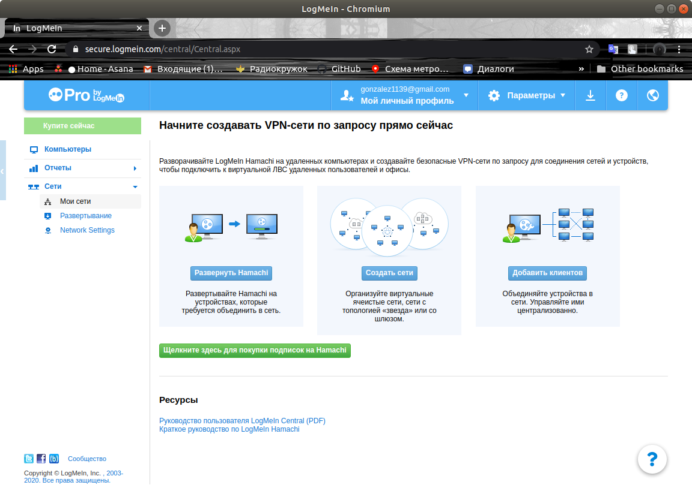
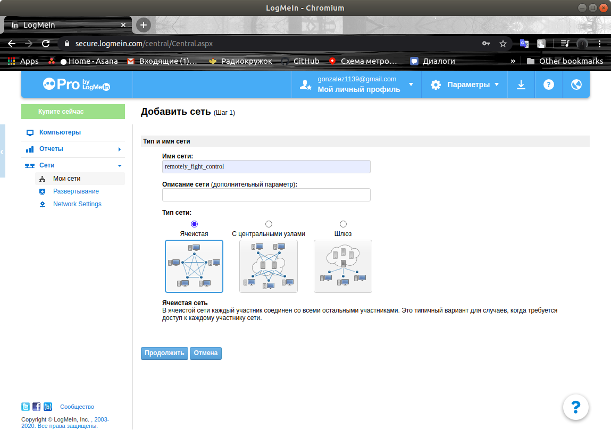
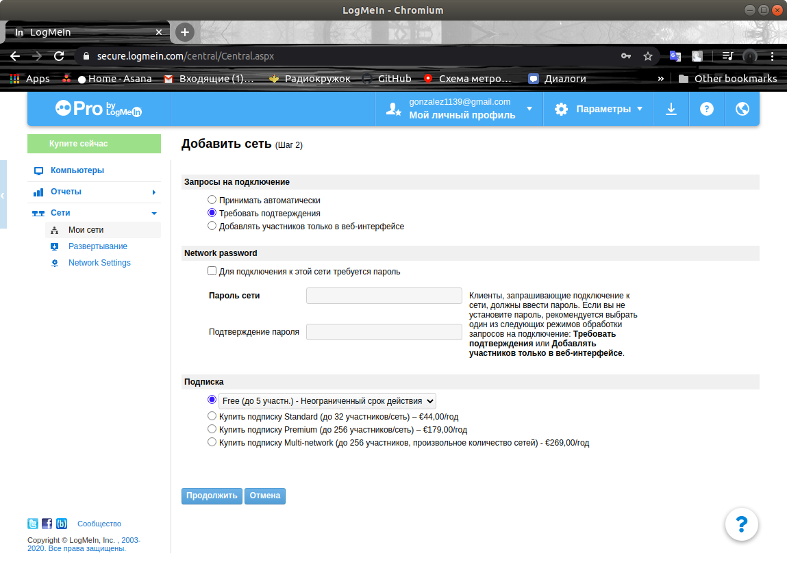

# Быстрое подключение к виртуальной сети

Для удаленного подключения и управления дроном или получения видеоизображения, можно подключить его к виртуальной сети *VPN*.

Вы можете подключить вашу систему к любой доступной вам сети, если у вас есть соответствующие правда доступа. В этой статье будет рассмотрен способ подключения к сети *LogMeIn*, как удобной и легкой в использовании.

## Создание вашей виртуальной сети

Создайте аккаунт и войдите на сайте [*LogMeIn*](https://www.logmein.com/).

После входа вы увидите основное меню управления вашими сетями.

Выберите пункт *Создать сети*.

В открывшемся окне введите название сети и выберите тип *Ячеистая*

В следующем окне в меню *Запросы на подключение* выберите *Требовать подключение*.

