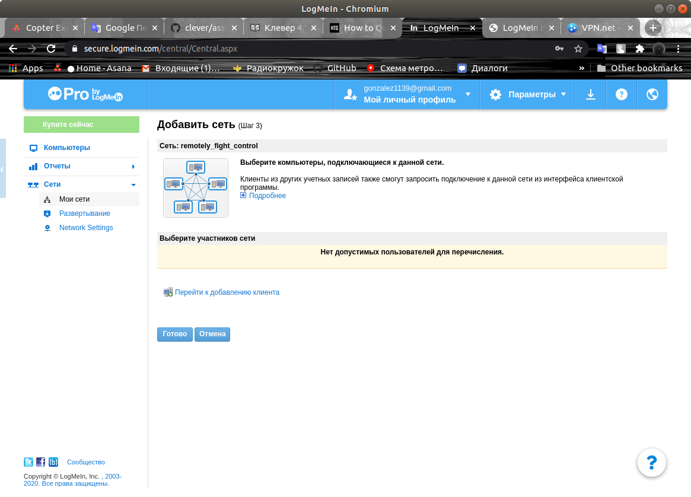
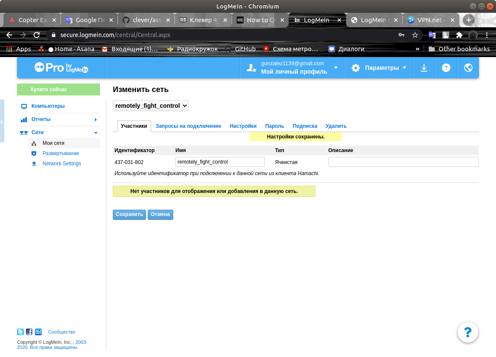
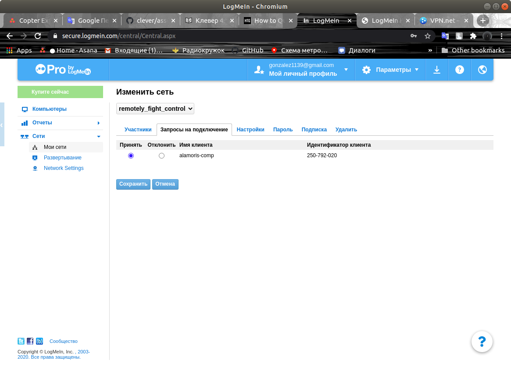
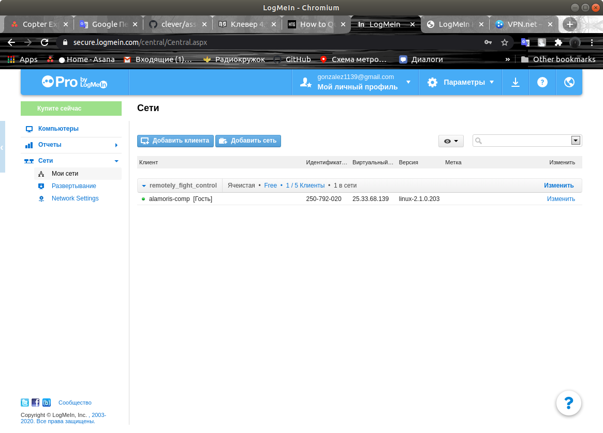

# Быстрое подключение к виртуальной сети

Для удаленного подключения и управления дроном или получения видеоизображения, можно подключить его к виртуальной сети *VPN*.

Вы можете подключить вашу систему к любой доступной вам сети, если у вас есть соответствующие правда доступа. В этой статье будет рассмотрен способ подключения к сети *LogMeIn*, как удобной и легкой в использовании.

## Создание виртуальной сети

Создайте аккаунт и войдите на сайте [*LogMeIn*](https://www.logmein.com/).

После входа вы увидите основное меню управления вашими сетями.


Выберите пункт *Создать сети*.

В открывшемся окне введите название сети и выберите тип *Ячеистая*.


В следующем окне в меню *Запросы на подключение* выберите *Требовать подключение*.


Нажмите *Готово* и перейдите к настройки сети.



В открывшемся окне *Изменить сеть* необходимо запомнить значение поля *Идентификатор сети*, он будет использоваться в дальнейшем для подключения.



## Установка менеджера *Hamachi* и подключение к сети

1. Скачайте *deb* пакет модуля *logmein_hamachi*.

    ```bash
    wget https://www.vpn.net/installers/logmein-hamachi_2.1.0.203-1_i386.deb
    ```

2. Установите модуль *hamachi*.

    ```bash
    sudo dpkg -i logmein-hamachi_2.1.0.203-1_i386.deb
    ```

3. Подключите установленный модуль к сети.

    ```bash
    hamachi login
    ```

4. Подключитесь к сети используя ее идентификатор.

    ```bash
    sudo hamachi do-join xxx-xxx-xxx
    ```

5. В поле ввода пароля нажмите *Enter*, если пароль не задан или введите его.

6. При успешном подключении вы увидете сообщение.

    *Joining 435-995-378 .. ok, request sent, waiting for approval*

7. Подтвердите подключение к сети в меню *Изменить сеть*, во вкладке *Запросы на подключение*.

    

8. Можно проверить, удалось ли подключить пользователя в окне *Мои сети*.

    

9. Повторите шаги 4-7 для подключения компьютера в случае если вы пользуетесь операционной системой Linux или обратитесь к инструкции для *Windows*.

### Подключение к сети с помощью Windows

TODO: Описать способ подключения с винды
