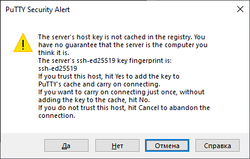

# Настройка NavTALink

## Установка

Для установки образа необходимо:

1. Скачать образ из [репозитория](https://github.com/CopterExpress/navtalink-ci-images/releases).
2. Записать образ на SD-карту (рекомендуется использовать утилиту [Etcher](https://www.balena.io/etcher/), которая доступна для большинства платформ).

**Внимание!** После первого запуска **Raspberry Pi 4** нужно подождать несколько минут, пока пройдёт инициализация образа.

## Настройка

### Подключение к терминалу

**Внимание!** После инициализации образа будет запущена Wi-Fi-сеть на внутреннем сетевом адаптере Raspberry Pi 4 с названием `NAVTALINK-<ID>`, где **ID** - идентификатор нового устройства (рекомендуется его запомнить или записать).

**Внимание!** Для настройки **NavTALink** необходим компьютер с установленным SSH-клиентом (например, [PuTTY](putty_setup.md)).

#### PuTTY

Перед подключением к терминалу **NavTALink** рекомендуется создать профиль для нового устройства:

1. Запустить PuTTY.
2. Задать `Host Name (or IP address)`: **192.168.30.1**.
3. Задать любое имя сессии в поле ввода в группе `Load, save or delete a stored session`→`Saved Sessions`.
4. Нажать на кнопку `Save`.

Для подключения к терминалу **NavTALink**-устройства необходимо:

1. Подключиться к WiFi-сети устройства.
2. Запустить PuTTY.
3. Выбрать имя сессии, соответствующее устройству.
4. Нажать на кнопку `Load`.
5. Нажать на кнопку `Open`.
6. Если это первое подключение к устройству, то PuTTY выведет запрос на добавление устройства в список доверенных. Необходимо нажать на кнопку `Да`.
7. На запрос `login as:` ввести: **pi**.
8. На запрос `pi@192.168.30.1's password` ввести: **raspberry**.

#### Консольные SSH-клиенты

Для подключения к терминалу **NavTALink**-устройства необходимо:

1. Ввести команду: `ssh pi@192.168.30.1`
2. Если это первое подключение к устройству, то клиент предложит добавить его в список доверенных. Нужно ответить положительно.
3. Ввести логин: **pi**.
4. Ввести пароль: **raspberry**.

### Обмен ключами шифрования

Для работы комплекса необходимо сгенерировать ключи шифрования на одном из устройств и передать их на второе устройство.

На первом устройстве необходимо:

1. Зайти в домашнюю директорию командой: `cd ~`.
2. Выполнить генерацию ключей командой: `wfb_keygen`.
3. Переместить один из ключей (`drone.key`, если устройство - БПЛА; `gs.key`, если устройство - наземная станция управления) в директорию `/etc` командой: `sudo mv <key> /etc`.

#### PuTTY

Следующим шагом необходимо загрузить оставшийся ключ при помощи утилиты PSFTP на второе устройство.

Для этого необходимо выполнить следующие действия на компьютере:

1. Запустить программу **PSFTP**.
2. Подключиться к первому устройству командой `open 192.168.30.1`.
3. Если подключение выполняется в первый раз, то на запрос о добавлении устройства в список доверенных `Store key in cache? (y/n)` ответить `y`.
4. На запрос `login as:` ввести: **pi**.
5. На запрос `pi@192.168.30.1's password` ввести: **raspberry**.
6. Скопировать оставшийся ключ на комьютер командой: `get <key>`.
7. Удалить ключ с устройства командой: `rm <key>`.
8. Отключиться от устройства командой: `exit`.
9. Запустить программу **PSFTP** ещё раз.
10. Подключиться к Wi-Fi-сети второго устройства.
11. Повторить пункты **2-5**.
12. Загрузить ключ на устройство командой: `put <key>`.
13. Удалить файл ключа с компьютера: `lrm <key>`.
14. Отключиться от устройства командой: `exit`.

#### Консольные SSH-клиенты

1. Подключиться к первому устройству командой `sftp pi@192.168.30.1`.
2. Если подключение выполняется в первый раз, то на запрос о добавлении устройства в список доверенных ответить положительно.
3. Ввести пароль: **raspberry**.
4. Скопировать оставшийся ключ на комьютер командой: `get <key>`.
5. Удалить ключ с устройства командой: `rm <key>`.
6. Отключиться от устройства командой: `exit`.
7. Подключиться к Wi-Fi-сети второго устройства.
8. Подключиться ко второму устройству, повторив **1-3**.
9. Загрузить ключ на устройство командой: `put <key>`.
10. Удалить файл ключа с компьютера: `lrm <key>`.
11. Отключиться от устройства командой: `exit`.

На втором устройстве необходимо переместить ключ в директорию `/etc` следующими командами:

1. Зайти в домашнюю директорию командой: `cd ~`.
2. Переместить ключ в директорию `/etc` командой: `sudo mv <key> /etc`.

### Настройка после установки

После установки образа и обмена ключами безопасности необходимо выполнить первичную настройку каждого из устройств:

1. Выполнить команду `sudo navtalink_update_adapter` (сетевой адаптер **rtl8812au** должен быть подключен к устройству). Команда произведёт поиск внешнего сетевого адаптера и сохранит его идентификатор в конфигурационном файле.
2. Если устройство будет установлено на БПЛА, ввести команду `sudo navtalink_set_role drone`, если на станции наземного управления - `navtalink_set_role gs`. Команда выполнит запуск необходимых служб на устройстве.

### Настройка wifibroadcast

Для редактирования конфигурационного файла **wifibroadcast** небходимо:

1. Ввести команду: `sudo nano /etc/wifibroadcast.cfg`.
2. Выполнить редактирование конфигурации.
3. Перезапустить сервис `wifibroadcast` командой: `sudo systemctl restart wifibroadcast@<device>`, где **device** - **drone** для БПЛА, **gs** для наземной станции управления.

[Подробнее о настройках wifibroadcast.](wifibroadcast_config.md)

### Настройка видеострансляции

**Внимание!** Данное действие должно выполняться на устройстве, расположенном на БПЛА.

Для редактирования настроек видеотрансляции необходимо:

1. Ввести команду: `sudo nano /lib/systemctl/system/navtalink-video.env`.
2. Выполнить редактирование конфигурации.
3. Перезапустить сервис `navtalink-video` командой: `sudo systemctl restart navtalink-video`.

[Подробнее о настройках видеострансляции.](navtalink_video.md)

### Подключение к терминалу через wifibroadcast

Возможно подключение к терминалу БПЛА по **SSH** через **wifibroadcast** (например, когда БПЛА находится за пределами зоны действия Wi-Fi точки доступа). Для этого необходимо выполнить из терминала наземной станции управления команду: `ssh pi@10.5.0.2`. Более подробно о подключении к терминалу по **SSH** можно ознакомиться в секции [Подключение к терминалу - Консольные SSH-клиенты](#Консольные-SSH-клиенты).
